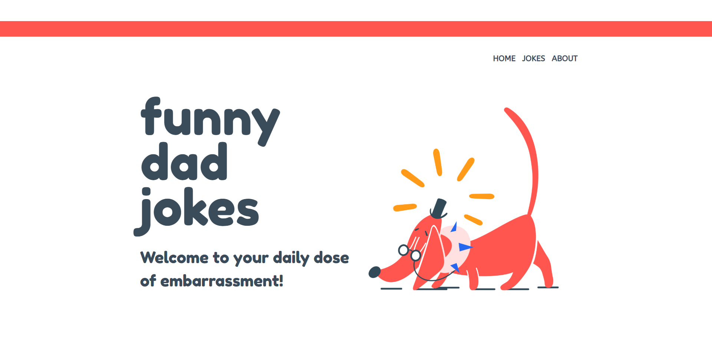
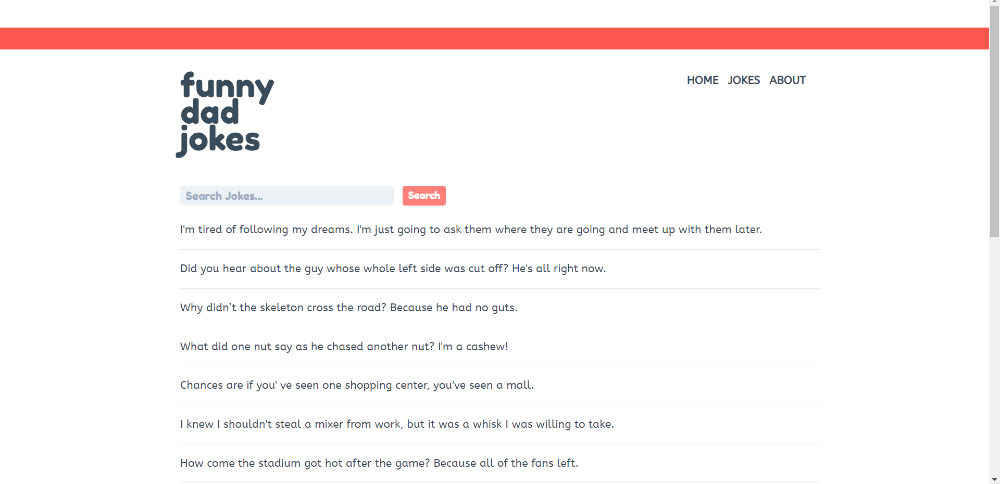
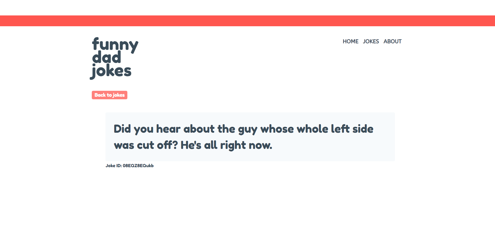
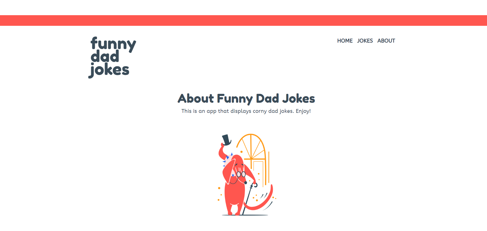

# 👨 Funny Dad Jokes 👨

Proyecto usando Nuxt.js para traer chistes de la API [icanhazdadjoke](https://icanhazdadjoke.com/api)

##### Tecnologías

- [Nuxt.js](https://nuxtjs.org/) (Server-Side Rendering progressive framework basado en Vue.js)
- [TailwindCSS](https://tailwindcss.com/)
- [SCSS](https://sass-lang.com/documentation/syntax)







## Build Setup

```bash
# install dependencies
$ npm install

# serve with hot reload at localhost:3000
$ npm run dev

# build for production and launch server
$ npm run build
$ npm run start

# generate static project
$ npm run generate
```

For detailed explanation on how things work, check out [Nuxt.js docs](https://nuxtjs.org).
